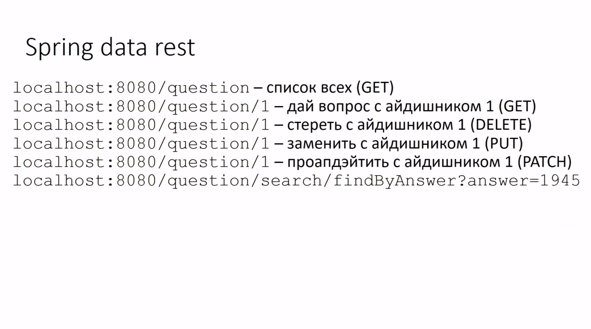

## Spring Cloud + Spring Data REST

```
Тестовой приложение на микросервисной архитектуре. Позволяет изучить связку Spring CLoud + Spring Data REST

1. math-micro - создаёт вопросы по математике
2. historic-micr - выдаёт вопросы по истории (предварительно их нужно занести в базу)
3. examinator-micr - выдаёт общий список вопросов по нескольким дисциплинам (в нашем случае история и математика)
```

```
Пример, как отрабатывает контроллер, генерируемый Spring`ом
```
